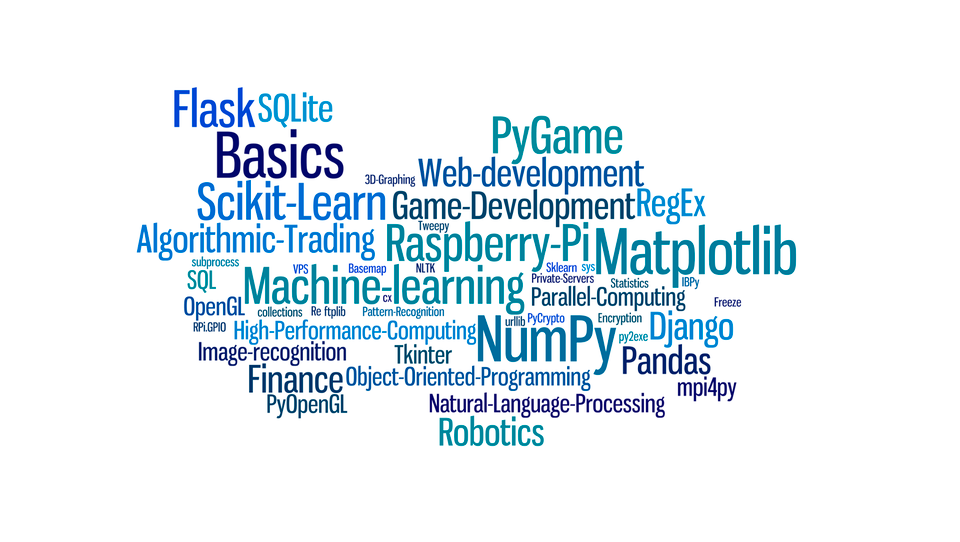

# Python
Python由荷兰数学和计算机科学研究学会的吉多·范罗苏姆 于1990 年代初设计，作为一门叫做ABC语言的替代品。 Python提供了高效的高级数据结构，还能简单有效地面向对象编程。Python语法和动态类型，以及解释型语言的本质，使它成为多数平台上写脚本和快速开发应用的编程语言， 随着版本的不断更新和语言新功能的添加，逐渐被用于独立的、大型项目的开发。  

python语言优点：

简单、易学、免费开源、 面向对象、可扩展性、可嵌入性、丰富的库、规范的代码、高级编程语言。

> Python是著名的“龟叔”Guido van Rossum在1989年圣诞节期间，为了打发无聊的圣诞节而编写的一个编程语言。

#### 安装python环境
python官网：https://www.python.org/		

#### 使用pip
- pip官网：https://pypi.org/project/pip/
- 安装包:pip install django
- 卸载包:pip uninstall django
- 查看已安装包:pip list
- 使用国内镜像源下载包:pip install django -i http://mirrors.aliyun.com/pypi/simple/

## 函数式编程

### 文件

## 面向对象编程
